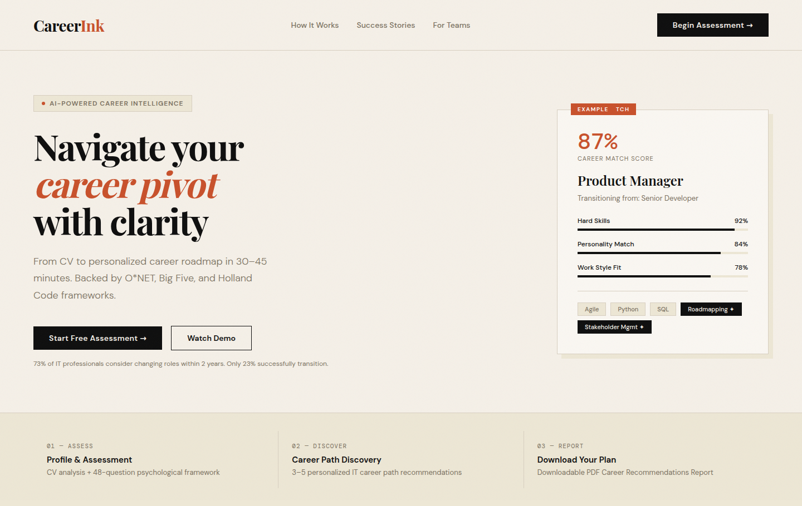

# CareerInk — AI-Powered IT Career Transition Platform

> From CV to personalized career roadmap in 30–45 minutes.

## 🚀 Live Demo

**👉 [https://q7fdu7oc.run.complete.dev](https://q7fdu7oc.run.complete.dev)**

---

## Screenshot



---

## Overview

CareerInk is a 2-agent AI system that helps IT professionals navigate internal career transitions through personalized assessment and career path discovery.

---

## How It Works

| Step | Agent | Description |
|---|---|---|
| 1 | Agent 1 | Paste your CV → NLP skill extraction |
| 2 | Agent 1 | 48-question psychological assessment (Big Five, Holland Code, IT Work Preferences) |
| 3 | Agent 2 | Weighted career matching algorithm → 3–5 ranked career cards |
| 4 | Agent 2 | Downloadable PDF Career Recommendations Report |

---

## Tech Stack

- **Backend:** Python 3.12 · FastAPI · ReportLab (PDF)
- **Frontend:** Vanilla HTML/CSS/JS
- **AI:** Deploy AI (Claude) for career justification sentences
- **Data:** 17 pre-extracted IT career profiles (JSON)

---

## Project Structure

```
careerink/
├── backend/
│   ├── main.py                  # FastAPI app + all routes
│   ├── models.py                # Pydantic request/response schemas
│   ├── agents/
│   │   ├── agent1.py            # CV analysis + assessment scoring
│   │   └── agent2.py            # Career matching + PDF generation
│   ├── data/
│   │   ├── questions.py         # 48 assessment questions
│   │   └── career_profiles.json # Pre-extracted IT career profiles
│   └── utils/
│       └── deploy_ai.py         # Deploy AI / Claude API client
├── frontend/
│   └── index.html               # Full single-page frontend
├── requirements.txt
└── .gitignore
```

---

## API Endpoints

| Method | Endpoint | Description |
|---|---|---|
| `POST` | `/api/cv/analyze` | Extract skills from CV text (min 500 chars) |
| `GET` | `/api/assessment/questions` | Get 48 randomized assessment questions |
| `POST` | `/api/assessment/submit` | Score assessment → build user profile |
| `POST` | `/api/careers/match` | Run matching algorithm → return career cards |
| `POST` | `/api/report/download` | Generate PDF career report |
| `POST` | `/api/optin` | Capture email opt-in |

---

## Matching Algorithm

| Component | Weight |
|---|---|
| Hard Skills Match | 40% |
| Personality Trait Match (Big Five) | 25% |
| Work Style & Values Match (Holland Code) | 20% |
| Experience & Seniority Fit | 15% |

Viability filter: Skills Score ≥ 35 AND Final Score ≥ 50
Diversity constraint: Max 2 recommendations per role family

---

## Running Locally

```bash
# Install dependencies
python3 -m pip install -r requirements.txt

# Start server
python3 -m uvicorn backend.main:app --host 0.0.0.0 --port 8000 --reload

# Open browser
open http://localhost:8000
```

---

## Environment Variables (Optional)

For Claude-generated justification sentences, add a `.env` file:

```env
CLIENT_ID=your_deploy_ai_client_id
CLIENT_SECRET=your_deploy_ai_client_secret
ORG_ID=your_org_id
```

Without these, the app falls back to template-based justifications.

---

## Psychological Frameworks

- **Big Five:** Openness, Conscientiousness, Extraversion, Agreeableness, Neuroticism (20 questions)
- **Holland Code RIASEC:** Realistic, Investigative, Artistic, Social, Enterprising, Conventional (18 questions)
- **IT Work Preferences:** Collaboration, Problem-Solving, Leadership Growth, Dynamic Environment (10 questions)

---

Built for the **Team Jobonauts AI Hackathon** · 2026
